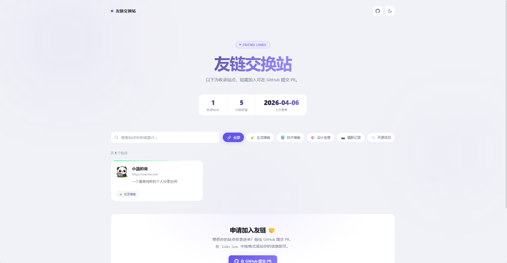
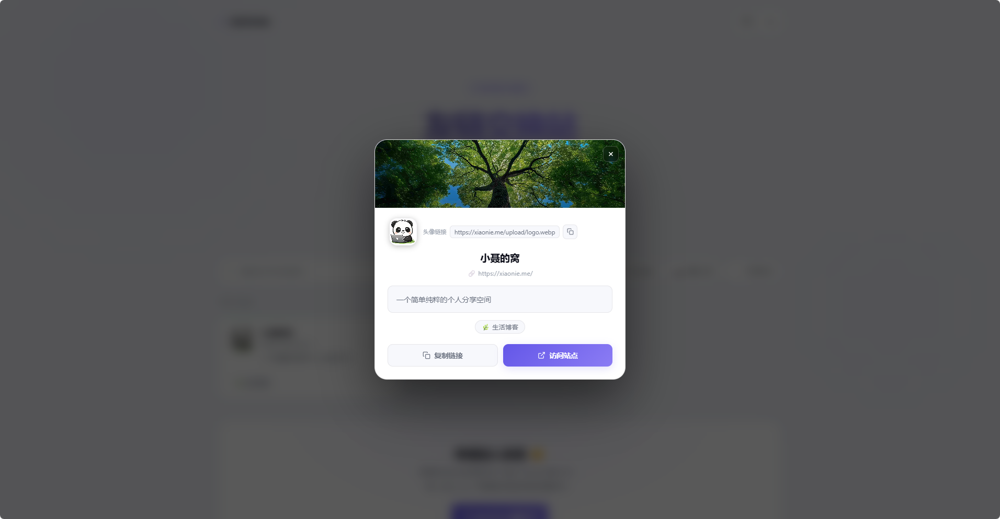

# 🔗 友链交换站

> 一个用 JSON 驱动、纯静态前端展示的友情链接收录仓库。




**在线预览：** [https://nieshilin.github.io/FRIEND-LINKS](https://nieshilin.github.io/FRIEND-LINKS)

---

## 📋 目录

- [项目结构](#-项目结构)
- [友链展示效果](#-友链展示效果)
- [如何申请友链](#-如何申请友链)
- [数据格式说明](#-数据格式说明)
- [本地预览](#-本地预览)
- [自部署说明](#-自部署说明)
- [友链撤除规则](#-友链撤除规则)

---

## 📁 项目结构

```
.
├── index.html       # 前端展示页面（纯静态，无需构建）
├── links.json       # 友链数据文件（核心）
├── README.md        # 本说明文档
└── CONTRIBUTING.md  # 详细贡献指南
```


## ✍️ 如何申请友链

### 提交 Issue（推荐新手）

点击 [👉 提交友链 Issue](https://github.com/YOUR_USERNAME/YOUR_REPO/issues/new?template=friend-link.md) 并填写以下信息：

```
站点名称：我的博客
站点地址：https://example.com
站点头像：https://example.com/avatar.png
站点描述：一句话介绍你的站点（30字以内）
分类标签：博客, 技术（从现有标签中选，最多3个）
```

---


#### 第一步：Fork 本仓库

点击右上角 **Fork** 按钮，将本仓库 Fork 到你的账号下。

#### 第二步：编辑 links.json

在你 Fork 的仓库中，打开 `links.json`，在 `"links"` 数组**末尾**添加你的友链信息：

```json
{
  "id": 999,
  "name": "你的站点名称",
  "url": "https://your-site.com",
  "avatar": "https://your-site.com/avatar.png",
  "description": "一句话介绍你的站点，30字以内。",
  "category": "life",
  "color": "#6366f1",
  "bg": "https://your-site.com/bg.png"
}
```

> ⚠️ **注意：`id` 请使用当前最大 id + 1，不可重复！**

#### 第三步：提交 Pull Request

1. Commit 你的修改，消息格式：`feat: 添加友链 - 你的站点名称`
2. 提交 PR 到本仓库的 `main` 分支
3. PR 标题格式：`[友链申请] 你的站点名称`

---

## 📐 数据格式说明

`links.json` 完整字段说明：

| 字段 | 类型 | 必填 | 说明 |
|------|------|------|------|
| `id` | number | ✅ | 唯一 ID，递增整数 |
| `name` | string | ✅ | 站点名称，≤ 20 字 |
| `url` | string | ✅ | 站点地址，需以 `https://` 开头 |
| `avatar` | string | ❌ | 头像图片 URL（建议 128×128 以上，留空自动降级为站点 favicon） |
| `description` | string | ✅ | 站点简介，≤ 50 字 |
| `category` | string | ✅ | 分类 ID，只能从下表中选一个 |
| `color` | string | ❌ | 卡片主色调，Hex 格式（默认 `#7c6cf7`） |
| `bg` | string | ❌ | 详情弹窗 banner 背景，支持纯色、渐变、图片（见下方示例） |

### 🖼 没有头像怎么办？

不必担心，以下方式任选其一，可以直接填入 `avatar` 字段：

| 方式 | 示例 URL | 说明 |
|------|---------|------|
| **站点 favicon** | `https://your-site.com/favicon.ico` | 最简单，直接用你网站的图标 |
| **GitHub 头像** | `https://github.com/你的用户名.png` | 直接用 GitHub 头像，无需上传 |
| **Gravatar** | `https://www.gravatar.com/avatar/邮箱MD5?s=128` | 通过邮箱关联的全球头像服务 |
| **随机头像** | `https://api.dicebear.com/7.x/bottts/svg?seed=任意字符串` | 用种子生成一个独特卡通头像 |
| **留空** | 不填该字段 | 前端自动尝试抓取站点 favicon，失败则显示 🌐 |

> 💡 推荐直接用 GitHub 头像：`https://github.com/YOUR_USERNAME.png`

### 🎨 bg 字段示例

```json
"bg": "https://example.com/banner.jpg"                     // 图片 URL（推荐）
"bg": "url('https://example.com/banner.jpg')"              // CSS url() 语法也行
"bg": "linear-gradient(135deg, #667eea 0%, #764ba2 100%)" // 自定义渐变
"bg": "#0ea5e9"                                            // 纯色
```

**分类列表（category 字段只能填以下 ID）：**

| ID | 名称 | 说明 |
|----|------|------|
| `life` | 🌿 生活博客 | 日常记录、旅行、随笔 |
| `tech` | 💻 技术博客 | 编程、开发、技术分享 |
| `design` | 🎨 设计创意 | UI/UX、视觉、插画 |
| `photo` | 📷 摄影记录 | 摄影作品、光影日记 |
| `open` | 🔧 开源项目 | 开源工具、项目主页 |

> ⚠️ 不接受自定义分类，请严格使用上表中的 `id` 值。

**完整 links.json 示例：**

```json
{
  "meta": {
    "title": "友链交换站",
    "description": "以下为收录站点，如需加入可在 GitHub 提交 PR。",
    "updated": "2026-04-06"
  },
  "categories": [
    { "id": "life",   "label": "生活博客", "icon": "🌿" },
    { "id": "tech",   "label": "技术博客", "icon": "💻" },
    { "id": "design", "label": "设计创意", "icon": "🎨" },
    { "id": "photo",  "label": "摄影记录", "icon": "📷" },
    { "id": "open",   "label": "开源项目", "icon": "🔧" }
  ],
  "links": [
    {
      "id": 1,
      "name": "示例站点",
      "url": "https://example.com",
      "avatar": "https://github.com/YOUR_USERNAME.png",
      "description": "这是一个示例站点。",
      "category": "life",
      "color": "#0ea5e9",
      "bg": "linear-gradient(135deg, #0ea5e9 0%, #6366f1 100%)"
    }
  ]
}
```

---


## 📄 License

[MIT](./LICENSE) © 2026 YOUR_USERNAME

欢迎 Star ⭐ 支持本项目！
